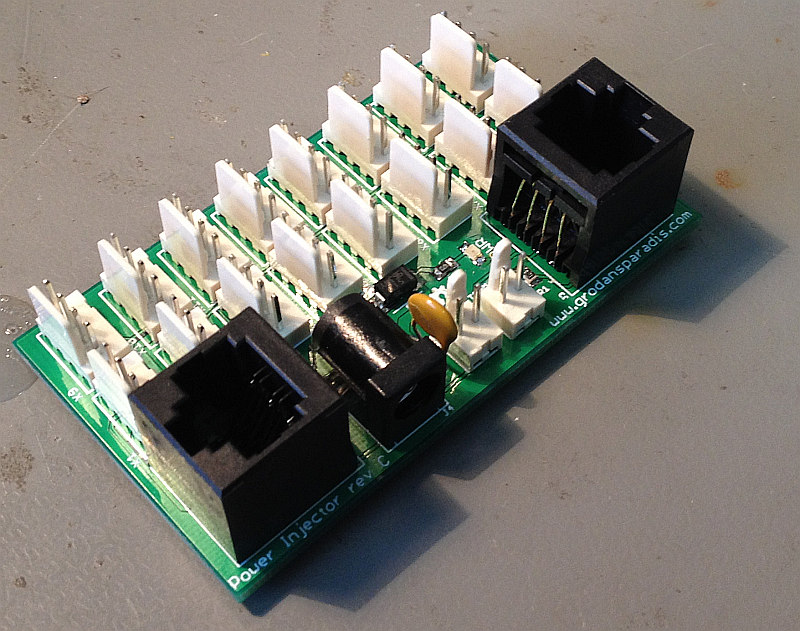

# Power injector module for CAN4VSCP

# Abstract

With the power injector you can power the CAN4VSCP bus and also power up to 16 CAN4VSCP modules using the inter module connector. This is a perfect companion board to use when you need to connect a number of CAN4VSCP boards in a cabinet and then connect them to the world.

It have two 120 ohm terminations that can be activated if needed and two RJ-45 connectors for easy connection.

The module has a resettable fuse that allow a maximum of 500 mA for all modules connected to the board. The fuse will trip at about 800 mA. This can be a good safety precaution for wired networks. 

There is also two smaller versions available.

This project is part of the <a href="http://www.vscp.org">VSCP (Very Simple Control Protocol) project</a>. 

## Project files

### User manual
  * [User Manual](https://grodansparadis.github.io/can4vscp-power-injector/#)

### Schematic, PCB, 3D files etc
  * [Schematics reversion C](./docs/images/power_injector_rev_c.svg)
 * Hardware design files is made in [KiCad](https://kicad.org) and can be found in the `kicad` directory. Valid from reversion C of the hardware.
   * Gerber files for PCB production can be found in the `gerber` directory (in the `kicad` folder).
 * Eagle schema and board files for reversion A, B and C can be found in the `eagle` directory. They are no longer actively updated.

 ### Firmware

 The firmware is developed in [MPLAB X IDE](https://www.microchip.com/mplab/mplab-x-ide) using the [XC8 compiler](https://www.microchip.com/mplab/compilers).

  * Binary release files is available [here](https://github.com/grodansparadis/can4vscp-beijing/releases)

### MDF - Module Description File(s)
  * [MDF file version: 9 Release date: 2020-05-14](http://www.eurosource.se/beijing_2.xml)
  * [MDF file version: 1.0.0 Release date: 2015-06-15](http://www.eurosource.se/beijing_1.xml)

### Support
If you need support, please open an issue in the [GitHub repository](https://github.com/grodansparadis/can4vscp-beijing/issues).

### Buy a ready made modules
You can buy a ready made module from [Grodans Paradis](http://www.grodansparadis.com).

### Project related links
  * [VSCP project](https://www.vscp.org)
  * [VSCP Documentation site](https://docs.vscp.org/)
  * [VSCP Wiki](https://github.com/grodansparadis/vscp/wiki)

