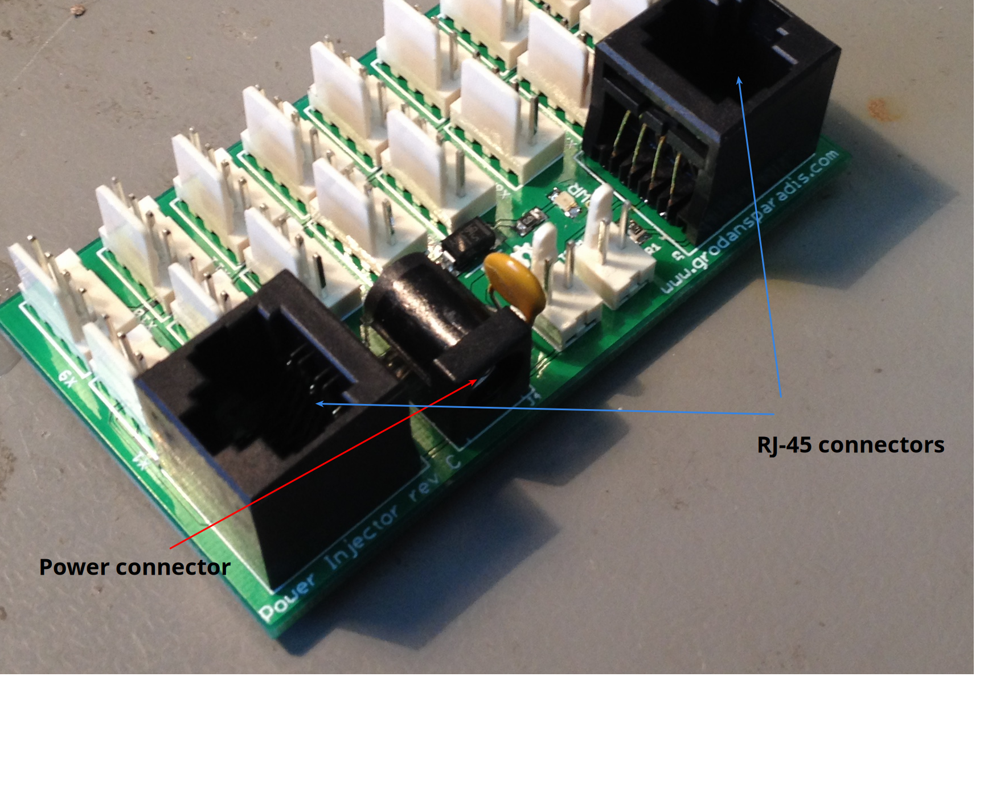

You need

  * RJ-45 patch cables or similar.
  * A stable +9V - +28V DC power source.
  * Some CAN4VSCP modules to connect to the bus.

The Power Injector module is powered from either a power connector (center pin is plus) or from  CAN4VSCP bus on one (**only one**) of the RJ-45 connectors. Think of the RJ-45 connectors as they are sitting on each end of a bus and that the terminations are on the same end as the power injector. 

[This article](https://github.com/grodansparadis/vscp/wiki/Connecting-CAN4VSCP-devices-together) have information on how the bus is powered and set up. Follow it for a reliable setup. Don't forget the 120 ohm terminators at each end of the bus. They are important\! 

When you power the module by inserting the RJ-45 cable the red LED on the board should light up to indicate it is powered. This is just a
power indicator LED. When you power the board for the first time the
green led starts to blink to indicate that the module search for a
nickname. During normal operation this LED should light steady.

Remember that there need to be at least
two CAN4VSCP (or other CAN device set to 125kbps) devices (one
additional) if you have the [Frankfurt
RS-232](https://github.com/grodansparadis/can4vscp-frankfurt-rs232)
or some other bus interface. A single device can't talk by
itself on a bus. It's an error.

  
[filename](./bottom-copyright.md ':include')
