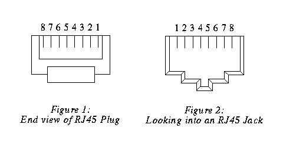

## Most current information

You can find the most current information about the Power Injector module at it's repository <https://github.com/grodansparadis/can4vscp-power-injector> and in the documentation at 
<https://grodansparadis.github.io/can4vscp-power.injector>. In the repository you can
also find links to the latest firmware, drivers and schematics etc for
its use. You can find links to where you can buy ready made modules here.

## The raw facts

| Parameter                     | Value         |
| ----------------------------- | ------------- |
| Current hardware reversion    | C             |
| Supply voltage                | \+9 - +28 VDC |
| PCB Size                      | 42mm x 72mm   |

## Schematics

Schematics: Rev C 

## Board components

## Connectors

### Power jack

The power connector is a standard 2.1/5.5 mm DC power jack with center pin positive. The voltage range is +9VDC to +28VDC. Maximum current is 500 mA. The power supply should be able to deliver at least 1A to have some margin.

### RJ-XX pin-out

The unit is powered over the CAN4VSCP bus or via the power connector. The CAN4VSCP normally uses CAT5 or better twisted pair cable. You can use other cables if you which. The important thing is that the CANH and CANL signals uses a twisted cable. For connectors you can use RJ10, RJ11, RJ12 or the most common RJ45 connectors.

Recommended connector is RJ-34/RJ-12 or RJ-11 with pin out as in this
table.

| Pin   | Use        | RJ-11 | RJ-12 | RJ-45 | Patch Cable wire color T568B |
| ----- | ---------- | ----- | ----- | ----- | ---------------------------- |
| 1     | \+9-28V DC |       |       | RJ-45 | Orange/White                 |
| 2 1   | \+9-28V DC |       | RJ-12 | RJ-45 | Orange                       |
| 3 2 1 | \+9-28V DC | RJ-11 | RJ-12 | RJ-45 | Green/White                  |
| 4 3 2 | CANH       | RJ-11 | RJ-12 | RJ-45 | Blue                         |
| 5 4 3 | CANL       | RJ-11 | RJ-12 | RJ-45 | Blue/White                   |
| 6 5 4 | GND        | RJ-11 | RJ-12 | RJ-45 | Green                        |
| 7 6   | GND        |       | RJ-12 | RJ-45 | Brown/White                  |
| 8     | GND        |       |       | RJ-45 | Brown                        |

 

**RJ-11/12/45 pin-out**

**!** Always use a pair of twisted wires for CANH/CANL for best noise immunity. If the EIA/TIA 56B standard is used this condition will be satisfied. This is good as most Ethernet networks already is wired this way.

### Inter module connector

The inter module connector can be used to connect modules that are physically close to each other together in an easy way. Remember that the minimum length of a connection cable is 30 cm.

| Pin | Description             |
| --- | ----------------------- |
| 1   | +9V - +28V DC           |
| 2   | CANH                    |
| 3   | CANL                    |
| 4   | GND                     |

  
[filename](./bottom-copyright.md ':include')
